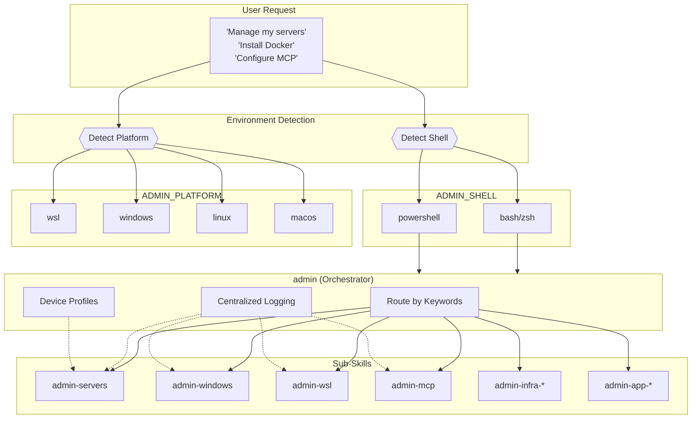
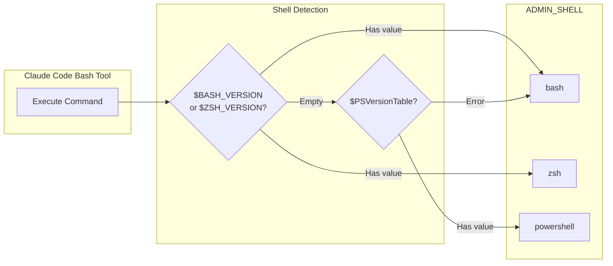
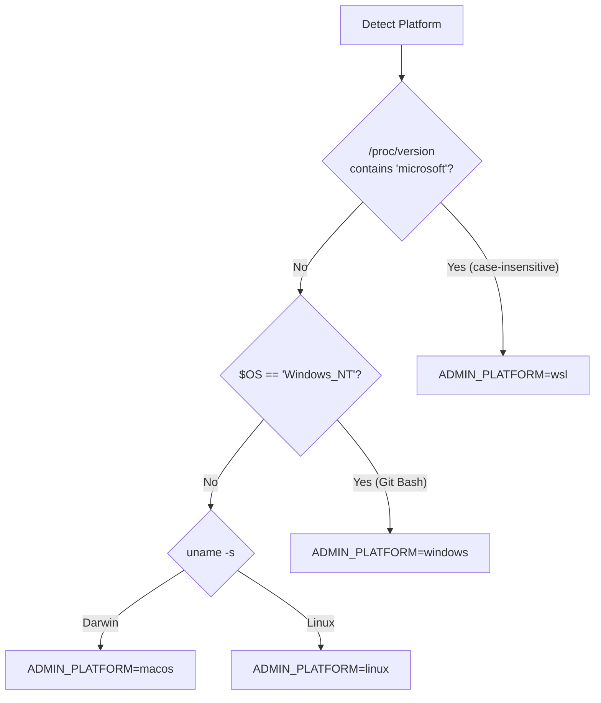
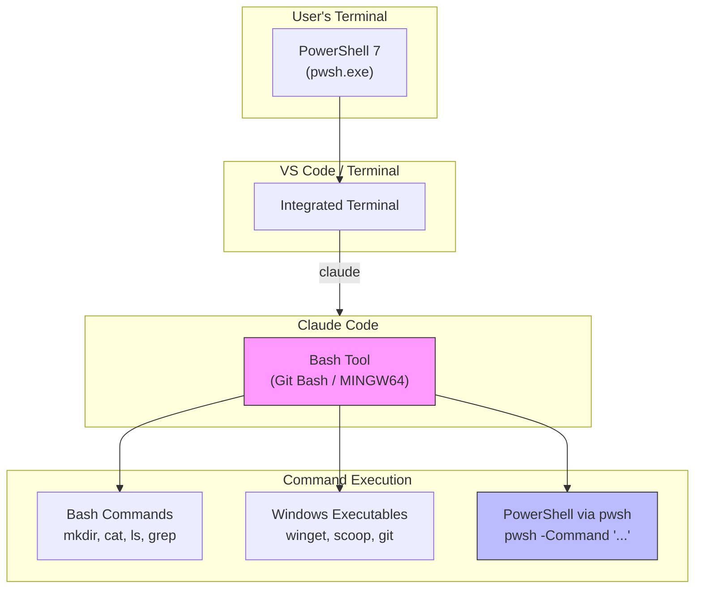
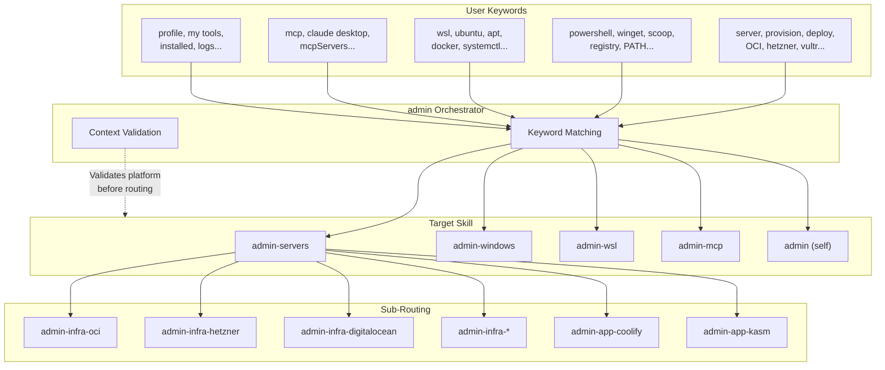
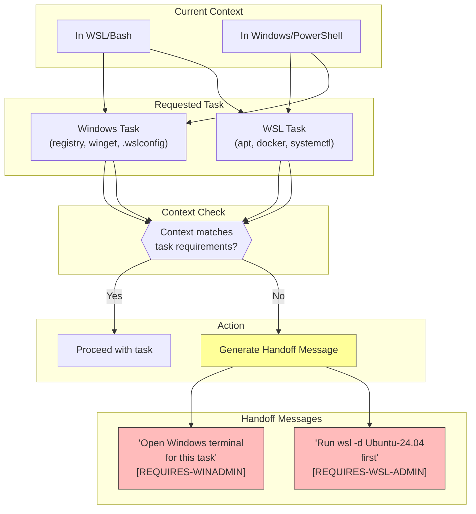
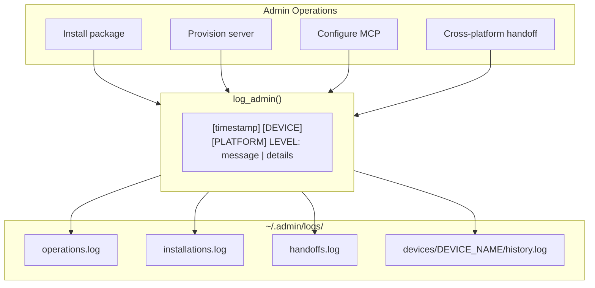
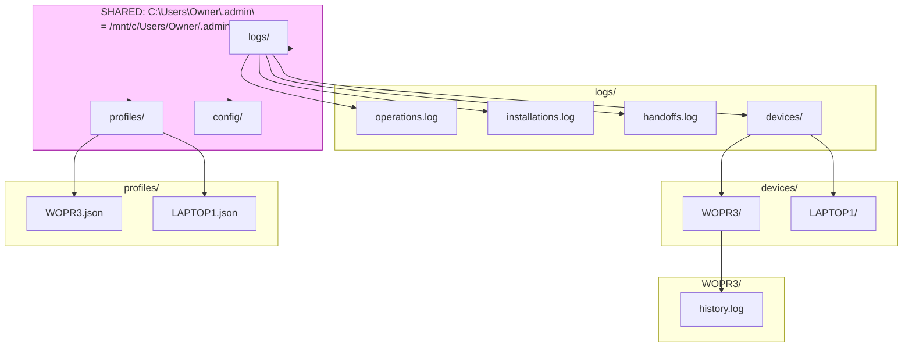
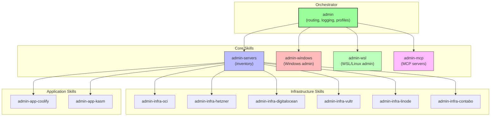

# Admin Skills Architecture

Visual overview of how the admin skills suite works together across different environments.

## High-Level Flow

## Shell Detection Flow

## Platform Detection Flow

## Claude Code on Windows (Git Bash)

## Skill Routing

## Handoff Protocol

## Logging Architecture

## Directory Structure

**Note**: On Windows+WSL machines, the `.admin` folder is **shared** on the Windows filesystem.
- Windows: `C:\Users\Owner\.admin\`
- WSL: `/mnt/c/Users/Owner/.admin/` (same physical location)

## Complete Admin Skills Suite

## Summary

| Component | Purpose | Files |
|-----------|---------|-------|
| **admin** | Orchestrator - routing, logging, profiles | `SKILL.md`, `references/*.md` |
| **admin-servers** | Server inventory management | Routes to infra-* and app-* |
| **admin-windows** | Windows-specific administration | PowerShell commands |
| **admin-wsl** | WSL/Linux administration | Bash commands |
| **admin-mcp** | MCP server configuration | Dual-mode (Bash + PowerShell) |
| **admin-infra-*** | Cloud provider management | OCI, Hetzner, DO, Vultr, Linode, Contabo |
| **admin-app-*** | Application deployment | Coolify, KASM |

**Total Skills**: 13 (1 orchestrator + 4 core + 6 infrastructure + 2 application)
