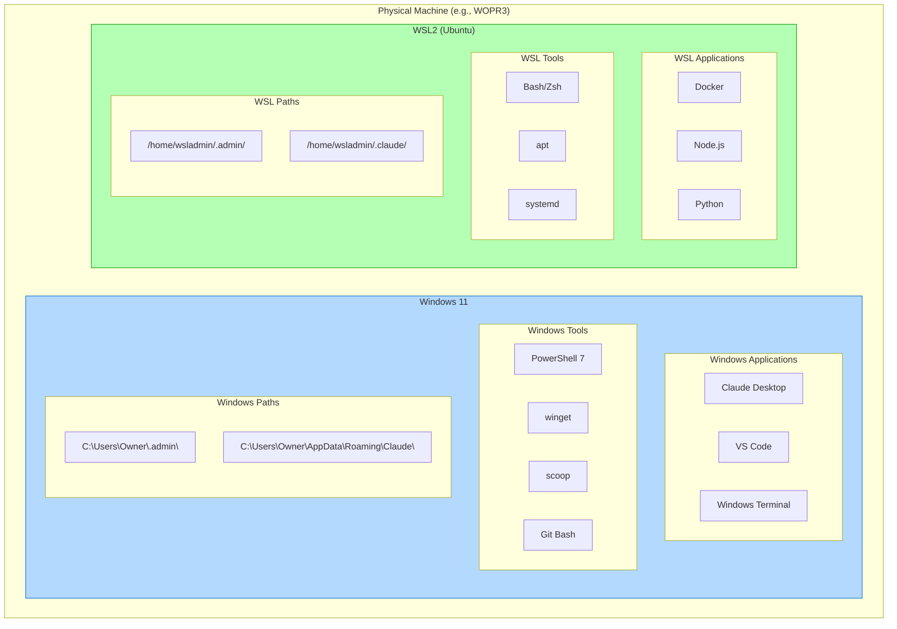
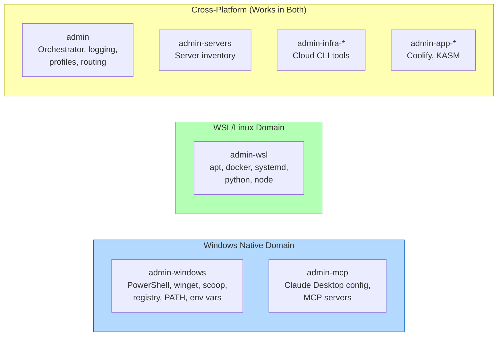
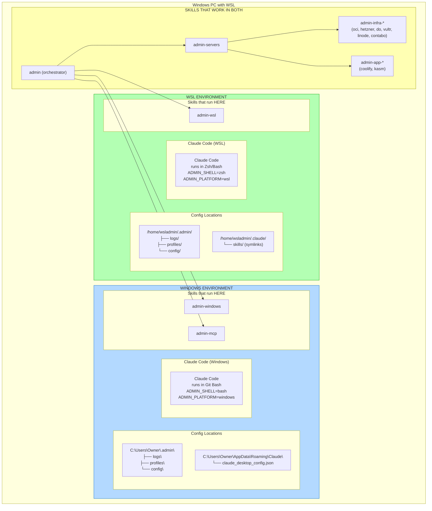
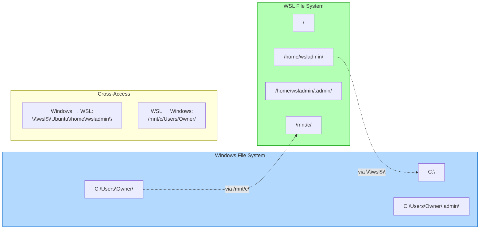
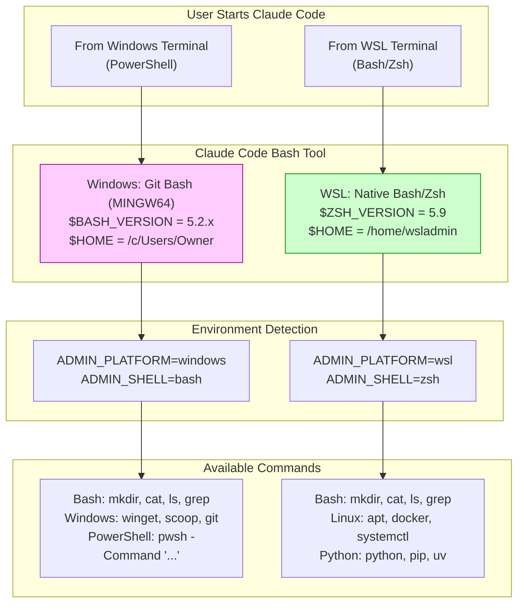
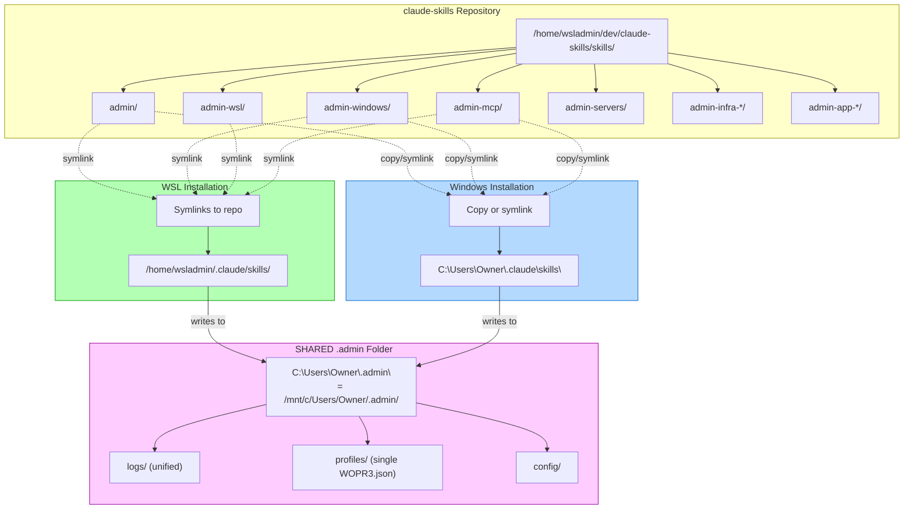

# Admin Skills: Windows + WSL Environment Map

How the admin skills map to a Windows PC running both native Windows and WSL.

## Physical Machine Layout



## Skill Ownership by Environment



## Detailed Environment Mapping



## Handoff Scenarios

```mermaid
flowchart TD
    subgraph Scenario1["Scenario: User in WSL asks to edit .wslconfig"]
        S1_START["User in WSL:<br>'Edit .wslconfig to increase memory'"]
        S1_DETECT["admin detects:<br>ADMIN_PLATFORM=wsl"]
        S1_ROUTE["Routes to: admin-windows<br>(because .wslconfig is Windows file)"]
        S1_CHECK{"Context valid?"}
        S1_HANDOFF["HANDOFF:<br>'Open Windows terminal<br>to edit .wslconfig'<br>[REQUIRES-WINADMIN]"]
    end

    S1_START --> S1_DETECT --> S1_ROUTE --> S1_CHECK
    S1_CHECK -->|"No - wrong platform"| S1_HANDOFF

    subgraph Scenario2["Scenario: User in Windows asks to install Docker"]
        S2_START["User in Windows:<br>'Install Docker'"]
        S2_DETECT["admin detects:<br>ADMIN_PLATFORM=windows"]
        S2_ROUTE["Routes to: admin-wsl<br>(because Docker runs in WSL)"]
        S2_CHECK{"Context valid?"}
        S2_HANDOFF["HANDOFF:<br>'Run wsl -d Ubuntu-24.04<br>to install Docker'<br>[REQUIRES-WSL-ADMIN]"]
    end

    S2_START --> S2_DETECT --> S2_ROUTE --> S2_CHECK
    S2_CHECK -->|"No - wrong platform"| S2_HANDOFF

    subgraph Scenario3["Scenario: User in WSL asks to provision OCI server"]
        S3_START["User in WSL:<br>'Provision an OCI server'"]
        S3_DETECT["admin detects:<br>ADMIN_PLATFORM=wsl"]
        S3_ROUTE["Routes to: admin-servers<br>→ admin-infra-oci"]
        S3_CHECK{"Context valid?"}
        S3_PROCEED["PROCEED:<br>OCI CLI works in both<br>environments"]
    end

    S3_START --> S3_DETECT --> S3_ROUTE --> S3_CHECK
    S3_CHECK -->|"Yes - cross-platform"| S3_PROCEED

    style S1_HANDOFF fill:#ffcccc,stroke:#cc0000
    style S2_HANDOFF fill:#ffcccc,stroke:#cc0000
    style S3_PROCEED fill:#ccffcc,stroke:#00cc00
```



## File System Access Between Environments



## Claude Code Execution Context



## Skill Installation Locations



## Quick Reference Table

| Skill | Windows Native | WSL | Notes |
|-------|---------------|-----|-------|
| **admin** | ✅ Works | ✅ Works | Orchestrator, adapts to environment |
| **admin-windows** | ✅ Native | ⚠️ Handoff | PowerShell tasks need Windows |
| **admin-wsl** | ⚠️ Handoff | ✅ Native | Linux tasks need WSL |
| **admin-mcp** | ✅ Native | ✅ Works* | *Can edit config via /mnt/c/ from WSL |
| **admin-servers** | ✅ Works | ✅ Works | Cross-platform |
| **admin-infra-*** | ✅ Works | ✅ Works | CLI tools work in both |
| **admin-app-*** | ✅ Works | ✅ Works | Cross-platform |

## Config File Locations

| Config | Windows Path | WSL Path | Shared? |
|--------|-------------|----------|---------|
| **Admin root** | `C:\Users\Owner\.admin\` | `/mnt/c/Users/Owner/.admin/` | **YES** |
| **Admin logs** | `C:\Users\Owner\.admin\logs\` | `/mnt/c/Users/Owner/.admin/logs/` | **YES** |
| **Device profile** | `C:\Users\Owner\.admin\profiles\WOPR3.json` | `/mnt/c/Users/Owner/.admin/profiles/WOPR3.json` | **YES** |
| Claude Desktop config | `C:\Users\Owner\AppData\Roaming\Claude\claude_desktop_config.json` | `/mnt/c/Users/Owner/AppData/Roaming/Claude/claude_desktop_config.json` | Yes (via /mnt/c) |
| Skills directory | `C:\Users\Owner\.claude\skills\` | `/home/wsladmin/.claude/skills/` | No (separate) |

**IMPORTANT**: The `.admin` folder is now **shared** between Windows and WSL. Both environments read/write to the same physical location on the Windows filesystem.

## Summary

```
┌─────────────────────────────────────────────────────────────────┐
│                     WINDOWS PC (e.g., WOPR3)                    │
├─────────────────────────────┬───────────────────────────────────┤
│      WINDOWS NATIVE         │              WSL                  │
├─────────────────────────────┼───────────────────────────────────┤
│  admin-windows ◄────────────┼──────────► admin-wsl              │
│  admin-mcp                  │                                   │
│                             │                                   │
│  Claude Code uses Git Bash  │  Claude Code uses Zsh/Bash        │
│  ADMIN_PLATFORM=windows     │  ADMIN_PLATFORM=wsl               │
│  ADMIN_SHELL=bash           │  ADMIN_SHELL=zsh                  │
├─────────────────────────────┴───────────────────────────────────┤
│                    CROSS-PLATFORM SKILLS                        │
│  admin (orchestrator) │ admin-servers │ admin-infra-*           │
│  admin-app-coolify    │ admin-app-kasm                          │
├─────────────────────────────────────────────────────────────────┤
│                 SHARED .admin FOLDER (Windows FS)               │
│         C:\Users\Owner\.admin\ = /mnt/c/Users/Owner/.admin/     │
│  ├── logs/           (unified logs from both environments)      │
│  ├── profiles/       (single WOPR3.json device profile)         │
│  └── config/         (shared configuration)                     │
└─────────────────────────────────────────────────────────────────┘
```
